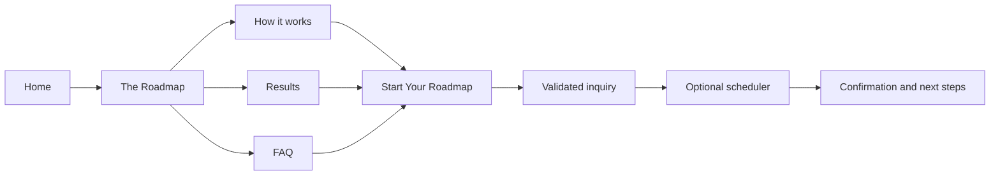
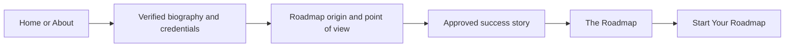
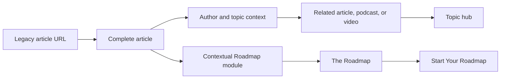
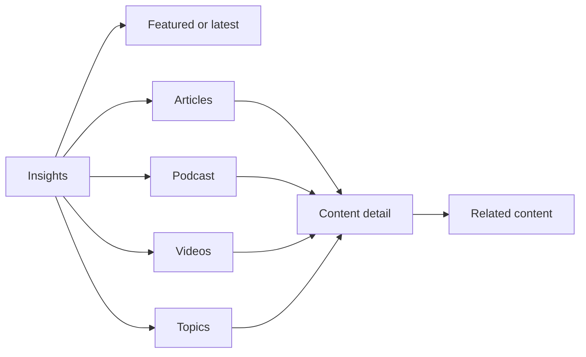
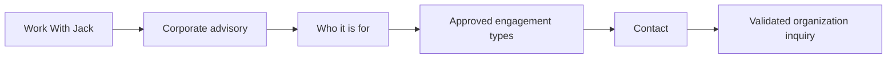

# User Journeys and Conversion Flows

## 1. Roadmap prospect

Primary intent: understand the problem, evaluate the method and fit, then begin a
qualified conversation.

UX rules:

- The hero communicates the tension and the Roadmap's role before describing the
  process.
- Roadmap support pages answer method, proof, and objection questions without
  competing primary CTAs.
- `/start` provides expectations, privacy/consent context, form validation,
  success/error states, and an optional scheduler only after a successful inquiry.
- Until form architecture and legal copy are approved, the form stays visibly
  unavailable and the route remains noindex.

## 2. Referred prospect

Primary intent: verify Jack's authority and fit before engaging.

UX rules:

- About leads with a human biography, then verified background, the origin of the
  work, and authored ideas.
- Credentials, client references, and testimonials appear only when supplied and
  approved.
- A contextual Roadmap link appears after the origin section; the primary CTA
  remains at the end of the page.

## 3. Organic content visitor

Primary intent: answer a question, understand Jack's perspective, and discover
related work without an abrupt sales interruption.

UX rules:

- Keep the legacy article URL, publication date, author, and canonical.
- Place the first commercial module after substantive editorial value, not before
  the article body.
- Related content uses the approved primary topic plus editorial relationships;
  it never reconstructs tag clouds or thin category archives.
- Topic hubs remain noindex until they contain an original introduction and a
  useful set of related content.

## 4. Returning reader or listener

Primary intent: locate recent or related material quickly.

UX rules:

- Content formats are real links and appear before the complete topic directory.
- Each listing has one featured item followed by a chronological collection.
- Podcast and video details support transcripts, dates, topics, and related
  material when source records are available.
- Newsletter UI is withheld until the list, cadence, promise, sender, and consent
  model are confirmed.

## 5. Organization buyer

Primary intent: understand the organizational offer and contact Jack with enough
context for routing.

UX rules:

- Work With Jack links every active offer to a substantive detail page.
- The Corporate route uses a contextual `Contact Jack` CTA rather than forcing the
  individual Roadmap language.
- The contact form captures only routing-critical information and documents
  consent and data handling after approval.

## Failure and recovery states

- Invalid input: retain entered values, identify fields inline, and move focus to
  an error summary.
- Submission failure: explain that the message was not sent and offer a safe retry;
  never display a false success state.
- Success: confirm receipt, state the approved response expectation, and offer the
  scheduler only if enabled.
- Missing content: show an editorially clear unavailable state and noindex the page;
  never fill the gap with invented claims.
- Unknown or retired URL: return a useful 404 unless the migration inventory names
  an exact related destination.
